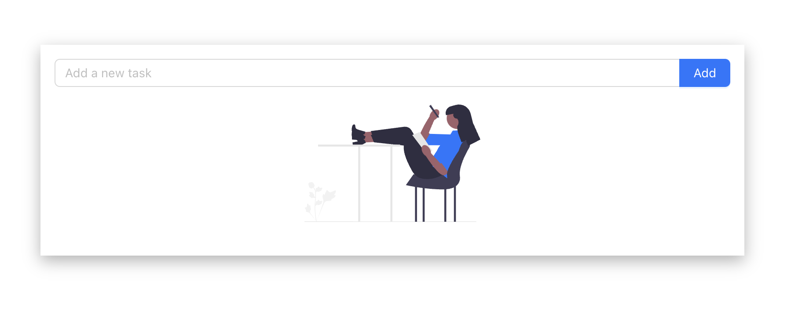

# React Todo List

A simple React application for managing tasks. This project allows you to add, mark, and delete tasks using a user-friendly interface.

## Technologies Used

- **React**
- **Ant Design**
- **Styled Components**

## Features

- Add new tasks
- Mark tasks as completed
- Delete tasks
- Responsive design with Ant Design components
- Styled with `styled-components`

## Patterns Used

Patterns for Styled Components: Custom patterns are used to ensure consistent styling and maintainable code across the application.
